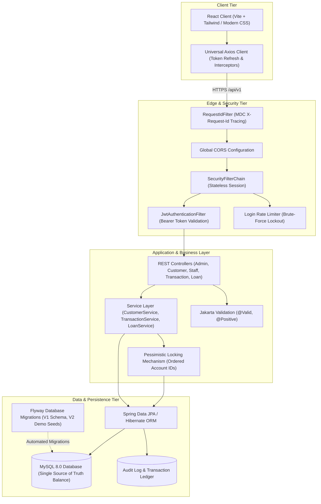

# 🏦 Nexus Online Banking System — Enterprise Spring Boot 3 & React

[](https://spring.io/projects/spring-boot)
[](https://www.oracle.com/java/)
[](https://react.dev/)
[](https://www.mysql.com/)
[](LICENSE)
[](.github/workflows/ci.yml)

> A production-grade, highly secure, full-stack digital banking platform engineered with **Spring Boot 3.5.6 (Java 21)** and **React (Vite)**. Features ACID transactional integrity with deadlock-free pessimistic locking, JWT authentication with refresh token rotation, role-based access control (RBAC), Flyway schema migrations, Docker containerization, OpenAPI/Swagger 3 documentation, and a modern fintech dashboard.

---

## 🌐 Live Deployment
- **Live Application (Frontend)**: [https://online-banking-system-sdp.vercel.app](https://online-banking-system-sdp.vercel.app)
- **Live Backend API**: [https://nexus-banking-backend.onrender.com](https://nexus-banking-backend.onrender.com)
- **Interactive API Documentation (Swagger UI)**: [https://nexus-banking-backend.onrender.com/swagger-ui/index.html](https://nexus-banking-backend.onrender.com/swagger-ui/index.html)
- **Actuator Health & Metrics**: [https://nexus-banking-backend.onrender.com/actuator/health](https://nexus-banking-backend.onrender.com/actuator/health)

### 📸 Application Previews
*(Place dashboard screenshots here: Customer Analytics, Transfer Flow, Staff Loan Approval, Admin System Health)*

---

## 🏛️ System Architecture



---

## 🛠️ Technology Stack

### Backend
- **Core Framework**: Spring Boot 3.5.6 on **Java 21 LTS**
- **Security**: Spring Security 6, JWT (`jjwt-api 0.12.6`), BCrypt (strength 12)
- **Data & Persistence**: Spring Data JPA, Hibernate, MySQL 8.0 Connector, Flyway Core & MySQL Migration
- **Financial Math**: Java `BigDecimal` for zero-loss currency computation
- **API Documentation**: Springdoc OpenAPI / Swagger UI 3 (v2.8.5)
- **Monitoring & Metrics**: Spring Boot Actuator, SLF4J + Logback with MDC Request Tracing
- **Testing**: JUnit 5, Mockito, AssertJ, Testcontainers MySQL, H2 In-Memory DB, JaCoCo Code Coverage

### Frontend
- **Framework & Tooling**: React 19, Vite 7, React Router DOM 7
- **HTTP Client**: Axios with universal request/response interceptors & token rotation
- **UI Components & Charts**: Lucide React Icons, Recharts (Spending Analytics), Canvas Confetti
- **Document Generation**: PDF Bank Statements (Client-side & Server-side iText)
- **Design System**: Responsive modern fintech UI, dark/light theme mode, micro-animations, skeleton loaders, and toast notifications

---

## 🔐 Security Architecture

1. **Stateless SecurityFilterChain**:
   - Explicitly rejects HTTP sessions (`SessionCreationPolicy.STATELESS`).
   - Every request is validated by `JwtAuthenticationFilter` (`OncePerRequestFilter`), resolving the token from the `Authorization: Bearer <token>` header.
2. **Environment-Driven Secrets**:
   - `JWT_SECRET` is strictly retrieved from the environment (enforced minimum 256 bits). Hardcoded secret keys are completely disallowed.
   - Dual-token architecture: Short-lived access token (15 mins) paired with a long-lived refresh token (7 days).
3. **Role-Based Access Control (RBAC)**:
   - Three distinct roles: `ROLE_CUSTOMER`, `ROLE_STAFF`, and `ROLE_ADMIN`.
   - Method-level security (`@PreAuthorize`) and route authorization rules enforce least privilege.
   - Strict customer data isolation ensures customers can only read and mutate their own accounts.
4. **BCrypt Password Hashing with Auto-Migration**:
   - Passwords hashed using Spring Security's `BCryptPasswordEncoder` (work factor 12).
   - Startup database runner automatically scans and transparently rehashes legacy plaintext credentials into secure BCrypt hashes.
5. **Brute-Force Rate Limiting**:
   - Login rate limiter blocks repeated authentication failures (5 attempts threshold triggers a 15-minute lockout).
6. **Unified CORS & Input Validation**:
   - Replaced wildcard `@CrossOrigin("*")` with a centralized `CorsConfigurationSource` driven by `ALLOWED_ORIGINS`.
   - Strict Jakarta Bean Validation (`@Valid`, `@NotNull`, `@Positive`, `@Email`) on all DTOs with an RFC 7807-compliant `@RestControllerAdvice` global exception handler.

---

## 💰 Financial Correctness & Transactional Integrity

- **Single Source of Truth Balance**:
  - The `balance` column on the `Customer` entity is the authoritative financial ledger balance. Disconnected, unindexed balance fields were eradicated and blocked from profile updates.
- **ACID Transaction Boundaries**:
  - All balance-mutating operations (`transferFunds`, `transferFundsByAccountNumber`, `deposit`, `withdraw`, `disburseLoan`) are annotated with `@Transactional(rollbackFor = Exception.class, isolation = Isolation.READ_COMMITTED)`.
- **Deadlock-Free Pessimistic Locking**:
  - Mutual fund transfers execute with `@Lock(LockModeType.PESSIMISTIC_WRITE)`.
  - Accounts are acquired in consistent numerical ID order (`min(fromId, toId)` locked first, then `max(fromId, toId)`). This guarantees database deadlocks are mathematically impossible even during heavy bidirectional concurrent transfers.
- **High-Precision Money Handling**:
  - All monetary values utilize `BigDecimal` with half-up rounding, eliminating IEEE 754 floating-point inaccuracies.
  - Per-transaction limits and daily velocity limits are strictly enforced.
- **Idempotency & Audit Ledger**:
  - Transfer endpoints support an `idempotencyKey` header to protect against accidental double-submissions or network retries.
  - Each financial transaction receives a unique reference identifier (`TXN-YYYYMMDD-UUID`).
  - Immutable `AuditLog` records actor ID, role, action, target resource, client IP, and UTC timestamp.
- **Soft Deletion**:
  - Soft-delete semantics (`status = INACTIVE`) ensure audit trails and transaction foreign keys remain intact.
- **SQL/JPQL Aggregations**:
  - Replaced inefficient in-memory `.stream()` computations with database-native aggregate queries (`SUM`, `COUNT`, `AVG`) with null-safe handling.

---

## 👥 Role Features & Workflows

| Capability | Customer | Staff | Admin |
| :--- | :---: | :---: | :---: |
| Self Registration & JWT Login | ✅ | — | — |
| View Real-time Balance & Profile | ✅ | — | — |
| Deposit & Withdrawal | ✅ | — | — |
| Peer-to-Peer Fund Transfers (ID or Account No) | ✅ | — | — |
| Apply for Loans (Personal, Education, Home, Vehicle) | ✅ | — | — |
| Loan Approval, Rejection & Direct Disbursement | — | ✅ | ✅ |
| Customer Directory & Profile Management | — | ✅ | ✅ |
| Customer Soft-Deactivation & Reactivation | — | — | ✅ |
| Staff Member Management (Create, List, Delete) | — | — | ✅ |
| Spending Analytics Charts & Inflow/Outflow Breakdown | ✅ | — | ✅ |
| Export Transactions to CSV | ✅ | ✅ | ✅ |
| Download Bank Statement (Branded PDF) | ✅ | — | — |
| System Health & Actuator Metrics | — | — | ✅ |
| High-Performance Aggregate Banking Reports | — | — | ✅ |

---

## 🔑 Demo Credentials

The database is automatically pre-seeded by Flyway (`V2__seed_demo_data.sql`):

| Role | Username | Password | Notes |
| :--- | :--- | :--- | :--- |
| **Admin** | `admin` | `admin123` | Full administrative control, reports, staff & customer management |
| **Staff** | `staff` | `staff123` | Credit underwriting, loan approval, customer ledger viewing |
| **Customer** | `johndoe` | `customer123` | Account `100000000001`, initial balance $25,000.00 |
| **Customer** | `janesmith` | `customer123` | Account `100000000002`, initial balance $15,000.00 |
| **Customer** | `robertb` | `customer123` | Account `100000000003`, initial balance $50,000.00 |

---

## 🚀 Running Locally

### Option 1: One-Click Docker Compose (Recommended)

Start the MySQL database, Spring Boot backend, and React frontend with a single command:

```bash
docker-compose up --build
```

- **Frontend Application**: `http://localhost:5173`
- **Backend API**: `http://localhost:8080`
- **Swagger Documentation**: `http://localhost:8080/swagger-ui/index.html`
- **MySQL Database**: `localhost:3306`

---

### Option 2: Running from Source

#### Prerequisites
- Java 21 LTS installed (`java -version`)
- Maven 3.9+ installed (`mvn -version`)
- Node.js 18+ and npm installed (`node -v`)
- MySQL 8.0 running locally

#### 1. Setup Backend
```bash
cd BACKEND/onlinebanking-backend

# Copy environment variables template
cp .env.example .env

# Run tests and start backend
mvn clean spring-boot:run
```
The backend initializes database tables and seeds demo accounts automatically via Flyway on port **8080**.

#### 2. Setup Frontend
```bash
cd FRONTEND/onlinebanking-frontend

# Install dependencies
npm install

# Start Vite development server
npm run dev
```
The frontend launches at `http://localhost:5173`.

---

## 🧪 Testing & Code Quality

### Running Backend Tests
Execute the full test suite including unit tests, validation tests, Spring Security authorization tests, and multithreaded concurrency tests:

```bash
cd BACKEND/onlinebanking-backend
mvn test
```

### Multithreaded Concurrency & Double-Spend Test
The test suite includes `RoleAccessIntegrationTests.testConcurrentTransfersDoNotOverdrawAccount()`, which simulates **20 concurrent threads** attempting simultaneous transfers against an account with limited funds. The test verifies:
- Exactly the allowed number of transfers succeed without race conditions.
- Zero overdraw occurs.
- Balance matches expected arithmetic down to the cent.

### JaCoCo Code Coverage
Generate the coverage report:
```bash
mvn jacoco:report
```
Inspect the report at:
`BACKEND/onlinebanking-backend/target/site/jacoco/index.html`

---

## 💡 What I Learned & Architectural Decisions

Key takeaways and architectural design decisions recorded in [`docs/DECISIONS.md`](docs/DECISIONS.md):

1. **Deadlock Prevention in Banking Transfers**:
   - When transferring funds from Account A to B concurrently with Account B to A, naive pessimistic locking locks A then B on thread 1, and B then A on thread 2, creating an immediate database deadlock.
   - *Solution*: By enforcing a global lock acquisition order based on primary key IDs (`id1 = min(from.id, to.id); id2 = max(from.id, to.id)`), locks are always requested in identical sequence across all threads, mathematically preventing circular waits.
2. **Stateless JWT with Token Rotation**:
   - Short-lived 15-minute access tokens minimize exposure if intercepted. The frontend Axios interceptor intercepts HTTP 401 responses and attempts a silent refresh before requesting re-authentication.
3. **Double-Spend Prevention via Database Transactions**:
   - Relying on application-layer checks for account balances is prone to race conditions. Combining `@Transactional(isolation = READ_COMMITTED)` with `SELECT ... FOR UPDATE` ensures serialized balance adjustments at the storage engine level.
4. **Zero-Loss BigDecimal Math**:
   - Floating-point representations (`double`, `float`) introduce binary rounding errors (e.g., `0.1 + 0.2 != 0.3`). Utilizing `BigDecimal` throughout all financial layers guarantees auditable accuracy.

---

## 📜 License
This project is open-source and available under the [MIT License](LICENSE).
