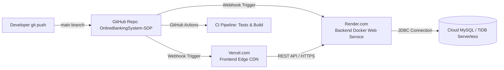

# 🚀 Deployment & Continuous Deployment (CI/CD) Guide: Nexus Banking

This guide provides the complete, recommended path for deploying the **Nexus Online Banking System** with **Automatic Continuous Deployment**:
- **Backend**: Spring Boot 3.5.6 (Java 21 LTS) deployed as a Docker Web Service on **Render**.
- **Frontend**: React 19 + Vite 7 Single Page Application deployed on **Vercel** (or Render Static Site).
- **Database**: Cloud MySQL 8 instance on **TiDB Cloud Serverless** or **Aiven for MySQL** (100% free tier).
- **Automatic Auto-Update (CD)**: Whenever you push code changes to GitHub `main`, both Render and Vercel automatically build and redeploy within minutes with zero downtime!

---

## 🏗️ Architecture & Auto-Deployment Pipeline



---

## 🔑 Environment Variables Matrix

### Backend Configuration (Render)

| Variable | Required | Description | Example / Recommended Value |
| :--- | :---: | :--- | :--- |
| `SPRING_PROFILES_ACTIVE` | Yes | Active Spring profile | `prod` |
| `PORT` | Yes | Injected by Render | `8080` (or leave default) |
| `DB_URL` | Yes | JDBC MySQL connection URL | `jdbc:mysql://<HOST>:<PORT>/<DB>?sslMode=VERIFY_IDENTITY` |
| `DB_USERNAME` | Yes | Database username | `<your_db_username>` |
| `DB_PASSWORD` | Yes | Database password | `<your_db_password>` |
| `JWT_SECRET` | Yes | Base64 or 32+ char secret | `c2VjdXJlQmFua2luZ1N5c3RlbVNlY3JldEtleUZvckpXVFRva2VuR2VuZXJhdGlvbjEyMzQ1Ng==` |
| `ALLOWED_ORIGINS` | Yes | Allowed frontend origins (supports wildcard) | `https://*.vercel.app,https://<your-app>.vercel.app,http://localhost:5173` |

### Frontend Configuration (Vercel)

| Variable | Required | Description | Example |
| :--- | :---: | :--- | :--- |
| `VITE_API_URL` | Yes | Render Backend Public URL (no trailing slash) | `https://nexus-banking-backend.onrender.com` |

---

## 🗄️ Step 1: Provision Free Cloud MySQL Database

The application requires a MySQL 8+ compatible database. We recommend **TiDB Cloud Serverless** or **Aiven for MySQL** (both are free forever without credit card):

### Recommended: TiDB Cloud Serverless (MySQL 8 Compatible)
1. Go to [https://tidbcloud.com](https://tidbcloud.com) and click **Sign in with GitHub**.
2. Click **Create Cluster** and choose **Serverless (Free Forever)**.
3. Once the cluster is active (approx. 10 seconds), click **Connect**.
4. Select language/driver: **Java / JDBC** (or MySQL CLI).
5. Copy your connection details:
   - **Host**: e.g., `gateway01.us-east-1.prod.aws.tidbcloud.com`
   - **Port**: `4000`
   - **User**: e.g., `xxxxxxxx.root`
   - **Password**: `<your_cluster_password>`
   - **Database**: `test` or create `online_banking`
6. Your `DB_URL` will look like:
   ```text
   jdbc:mysql://gateway01.us-east-1.prod.aws.tidbcloud.com:4000/online_banking?useSSL=true&allowPublicKeyRetrieval=true&serverTimezone=UTC
   ```
> **Note**: Flyway automatically runs database migrations (`V1__init_schema.sql` and `V2__seed_demo_data.sql`) during the very first boot of the Spring Boot application, creating all required tables and seeding demo users (Customer, Staff, Admin) automatically!

---

## ⚙️ Step 2: Deploy Backend to Render (with Auto-Deploy)

1. Sign into [https://render.com](https://render.com) using your GitHub account (`Leela-Akash`).
2. Click **New +** > **Web Service**.
3. Select your repository: `Leela-Akash/OnlineBankingSystem-SDP`.
4. Configure service parameters:
   - **Name**: `nexus-banking-backend`
   - **Region**: Choose the region closest to your database (e.g. Frankfurt, Oregon, Ohio).
   - **Root Directory**: `BACKEND/onlinebanking-backend`
   - **Environment**: **Docker**
   - **Dockerfile Path**: `Dockerfile`
   - **Auto-Deploy**: **Yes** *(ensures every future git push automatically rebuilds and deploys!)*
5. Scroll down to **Environment Variables** and add:
   - `SPRING_PROFILES_ACTIVE` = `prod`
   - `DB_URL` = `<your_jdbc_mysql_url>`
   - `DB_USERNAME` = `<your_mysql_username>`
   - `DB_PASSWORD` = `<your_mysql_password>`
   - `JWT_SECRET` = `c2VjdXJlQmFua2luZ1N5c3RlbVNlY3JldEtleUZvckpXVFRva2VuR2VuZXJhdGlvbjEyMzQ1Ng==`
   - `ALLOWED_ORIGINS` = `https://*.vercel.app,http://localhost:5173` *(you can update with your exact Vercel domain once deployed)*
6. Set **Health Check Path** to `/actuator/health`.
7. Click **Create Web Service**.
8. Render will pull the repo, run the multi-stage Docker build, start Spring Boot, run Flyway migrations, and report healthy.
9. Copy your backend service URL (e.g., `https://nexus-banking-backend.onrender.com`).

---

## 💻 Step 3: Deploy Frontend to Vercel (with Auto-Deploy)

1. Sign into [https://vercel.com](https://vercel.com) using your GitHub account (`Leela-Akash`).
2. Click **Add New...** > **Project**.
3. Import your repository: `Leela-Akash/OnlineBankingSystem-SDP`.
4. Configure project settings:
   - **Framework Preset**: `Vite`
   - **Root Directory**: Click **Edit** and choose `FRONTEND/onlinebanking-frontend`.
   - **Build Command**: `npm run build`
   - **Output Directory**: `dist`
   - **Install Command**: `npm ci`
5. In the **Environment Variables** section:
   - Key: `VITE_API_URL`
   - Value: `https://nexus-banking-backend.onrender.com` *(your Render backend URL from Step 2, no trailing slash)*
6. Click **Deploy**.
7. Vercel will install dependencies, build the production bundle, and deploy to a live URL (e.g., `https://online-banking-system-sdp.vercel.app`).
8. *(Optional)* Return to Render and update `ALLOWED_ORIGINS` with your exact Vercel URL:
   `https://online-banking-system-sdp.vercel.app,https://*.vercel.app`

---

## 🔄 Step 4: How Automatic Updates Work ("Continuous Deployment")

Now that both Vercel and Render are linked to your GitHub repository:

1. **Make changes locally** in the IDE (e.g., UI adjustments, new features, bug fixes).
2. **Commit and push** to the `main` branch:
   ```bash
   git add .
   git commit -m "feat: your new feature or improvement"
   git push origin main
   ```
3. **What happens automatically**:
   - **GitHub Actions** runs unit and integration tests across backend and frontend.
   - **Vercel** detects the push and triggers an automated frontend build & deployment (~20 seconds).
   - **Render** detects the push and triggers a Docker rebuild & rolling deployment (~2 minutes).
   - If database migrations were added (`V3__...`), Flyway automatically applies them to your cloud database upon backend restart.
   - **Zero manual intervention required!** Your live website updates seamlessly.

---

## 🧪 Step 5: Production Smoke Test Checklist

Once live:

1. **Actuator Health Check**:
   - Open: `https://<backend-url>/actuator/health`
   - Status should be `{"status":"UP"}`.
2. **Interactive Swagger API Documentation**:
   - Open: `https://<backend-url>/swagger-ui/index.html`
3. **Customer Login & Operations**:
   - Open your Vercel frontend URL.
   - Log in: `cust1` / `cust123` (or `johndoe` / `customer123`).
   - Confirm balance and recent transactions appear.
   - Transfer ₹50 to account `1001001002` (`cust2`).
   - Download the branded PDF statement.
4. **Staff Approval Portal**:
   - Log in: `staff1` / `staff123` (or `staff` / `staff123`).
   - Check pending loan requests and approve or reject.
5. **Admin Analytics Dashboard**:
   - Log in: `admin` / `admin123`.
   - Verify aggregate charts and manage customer/staff accounts.
